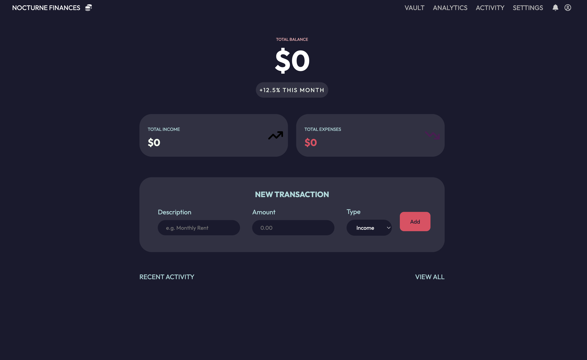
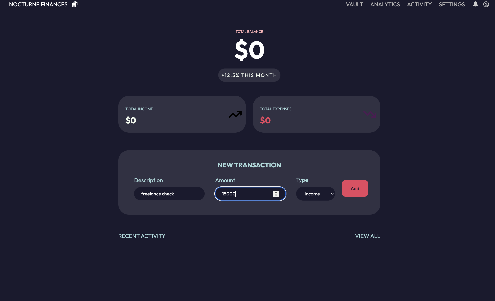
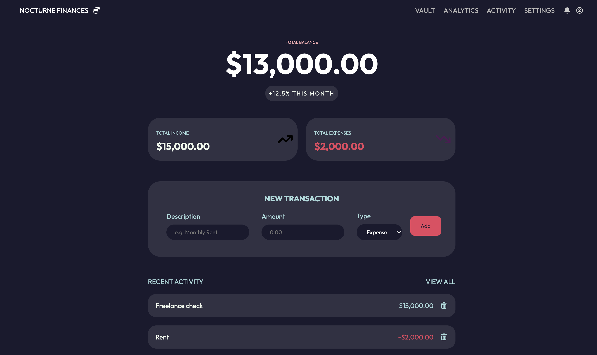

# 💰 Nocturne Finances — Budget Tracker

A sleek, dark-themed budget tracker app built with vanilla HTML, CSS, and JavaScript. Designed from a custom Figma prototype and implemented from scratch.



## Features

- Add income and expense transactions
- Live balance calculation that updates instantly
- Color-coded transactions
- Delete individual transactions
- Automatic currency formatting (USD)
- Clean, responsive dark UI designed in Figma

## Screenshots

### Dashboard


### Adding a Transaction


### Transaction List


## Live Demo

[View Live App](https://ck-tot.github.io/Simple-budget-app/)

## Built With

- HTML
- CSS (Custom Properties / CSS Variables)
- Vanilla JavaScript
- Figma (UI Design)
- Font Awesome (Icons)
- Google Fonts — Outfit

## What I Learned

- Using the `reduce` method to calculate running totals from an array
- The DRY principle — writing helper functions to avoid repeated code
- Translating a Figma design into a working UI
- Managing application state with a single source of truth array
- Conditional rendering based on transaction type

## Setup

Clone the repo and open `index.html` in your browser. No dependencies or build tools required.
```bash
git clone https://github.com/CK-Tot/Simple-budget-app
```

---

Designed and built by CK-Tot